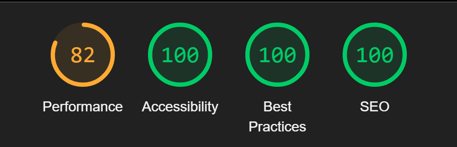

# Documentation project 2 - Group 26

Website: <http://it2810-26.idi.ntnu.no/project2/>

Repository: <https://git.ntnu.no/IT2810-H24/T26-Project-2>

## Usage

### Running the frontend locally

The following commands can be run in the `T26-Project-2/frontend` directory:

- `npm install` to install dependencies.
- `npm run dev` to start the development server
- `npm run prettier` to check code formatting
  - `npm run prettier:fix` to fix formatting
- `npm run lint` to check for linting errors
  - `npm run lint:fix` to fix auto fixable linting errors
- `npm test` to run all frontend tests
  - `npm run coverage` to generate a test coverage report at `frontend/coverage/index.html`
- `npm run build` to build the project
  - it will be built in the `dist` folder

### Restarting the frontend on the VM

Navigate to the `~T26-Project-2/frontend` directory

- `npm ci` to install dependencies (and stop on mismatches between the `package[-lock].json` files)
- `npm run build` to build the project
- `../reload_server_frontend` to update the apache server

### Running the backend locally

The following commands can be run in the `T26-Project-2/backend` directory:

- `npm install` to install dependencies.
- `npm run prettier` to check code formatting
  - `npm run prettier:fix` to fix formatting
- `npm run lint` to check for linting errors
  - `npm run lint:fix` to fix auto fixable linting errors
- `npm test` to run all backend tests
  - `npm run coverage` to generate a test coverage report at `backend/coverage/index.html`
- `npm run build` to build the project
- `npm run start` to start the server

### Running the backend on the VM

Navigate to the `~T26-Project-2/backend` directory

- `npm install pm2 -g` to install pm2 globally
- `npm ci` to install dependencies (and stop on mismatches between the `package[-lock].json` files)
- `npm run build` to build the project
- `pm2 start dist/index.js` to start the server in the background
  - `pm2 logs` to see the logs
  - `pm2 list` to see the status of the process
  - `pm2 restart <id>` to restart the process (use the id from `pm2 list`)
  - `pm2 stop <id>` to stop the process (use the id from `pm2 list`)

### Setting up the database / backend for the first time

#### NB: This is already done, so you don't need to do this

```bash
cd ~/T26-Project-2

# Download the dataset
curl -L -o archive.zip https://www.kaggle.com/api/v1/datasets/download/asaniczka/tmdb-movies-dataset-2023-930k-movies
sudo apt-get install unzip
unzip archive.zip
rm archive.zip
mv TMDB_movie_dataset_v11.csv TMDB_movie_dataset.csv

# Parse the data and insert it into the database
pip install pandas pymongo tqdm
./parse_data.py db 0

# Start the backend
cd backend/
npm ci
npm run build
pm2 start dist/index.js
```

## MovieDB

MovieDB is a website for browsing through a wide variety of movies. Current features include:

- A feed of movies
- Detailed movie information pages
- Search for movie titles
- Sorting and filtering with various options
- Changing users by updating your username
- Adding reviews for movies
- A feed of the latest reviews from all users
- A list of your own reviews

## Choices

### Frontend

We've used UI components from `shadcn`, as it allows us to copy and paste components directly into our project. This gives us more flexibility and control over the components and provides the opportunity to, for example, adjust styling to meet our needs. It also allows us to include only the components we need, resulting in a smaller bundle size and faster load times.

We use `Tailwind CSS`, instead of traditional CSS, because we believe it makes us develop code more efficiently, and it allows us to write less code to achieve the same result.

We use `Apollo Client` for managing global state across all components and for creating GraphQL queries to the backend. It also provides caching of our queries to improve the performance of the application. For GraphQL queries and types, we use `GraphQL Codegen` to generate the types automatically based on the schemas provided by the backend. This makes our queries type-safe in the frontend and we only need to define the types in one place (the types are generated by running `npm run generate`).

LocalStorage is used to remember the username of the logged in user, so that the user is remembered even when you close the browser. SessionStorage on the other hand is used to remember filters, sorting option and search during a session.

### Backend

For the backend, we use `Apollo Server` with `MongoDB` as our database. We believe that `MongoDB` works well in combination with GraphQL because it allows us to store data in a similar format to the GraphQL types. This minimizes the work required for processing data before inserting it into the database and after retrieving data from the database.

Our sorting, filtering and search logic is in the backend so that we can use the whole dataset. Here we use indexes in order to improve performance. While we initially used a text index for titles, we later opted for regex search to allow for partial match. We found that this led to a much better user experience, with minimal impact on performance.

We initially had over 700.000 movies in our database, but we later found that most movies were inappropriate or just joke entries. Therefore, we decided to remove many movies based on some criteria. If certain fields are null for example, it doesn't make sense to have the entries: title, release_date, overview, and runtime all have to have a value. Other criteria get rid of a lot of the inappropriate movies: adult = false, imdb_id != null. Then, we only kept the top 10.000 most popular movies. This ensures that we have as many known movies as possible while avoiding most of the inappropriate/irrelevant movies that haven't been filtered out already.

### Caching

We use caching in order to reduce the number of queries to the backend and improve performance. This way we avoid fetching the same data multiple times. When it comes to the caching of reviews, we had to find a balance between having up-to-date data and minimizing the number of queries. We found that the best solution was to have the user refresh in order to be sure of having the latest updates. This allows us to update the cache manually when adding/deleting a review, reducing the number of queries considerably while still feeling intuitive for the user.

### Accessibility

We’ve put a lot of effort into making sure our application is accessible for everyone. Accessibility is a core part of what makes a good user experience, so here are some of the steps we've taken to make our app more inclusive:

- **Semantic HTML**: We use the right HTML tags to ensure that screen readers can easily interpret and present the content to users who rely on them. The few places `<div>`-tags have been used, this has been a deliberate choice, as no other element carried the appropriate semantic meaning.
- **ARIA Attributes**: We've added `aria-label` to give elements clear, descriptive names and used `aria-role` to specify roles when they’re not obvious from the element type.
- **Image Descriptions**: All images come with `alt` text. This way, if an image doesn’t load for any reason, the description still provides the necessary context for what was supposed to be there.
- **Keyboard Navigation**: The whole app is built to be navigable using only a keyboard, which is how some users prefer or need to interact with websites.
- **Color Contrast**: We’ve checked that all text and interactive elements have enough contrast with their backgrounds to be easily readable, especially for users with visual impairments.

To catch any accessibility issues, we’ve been using `Google Lighthouse`, a built-in browser tool, to analyze accessibility as well as performance, best practices, and Search Engine Optimization (SEO). Here’s an example of a Lighthouse report for the homepage’s initial load:



*Note: This test was run with the backend on a local server, so the performance results might not be fully accurate.*

### Note

At the moment we perform several queries in order to maintain concistency with regards to the reviews. As this is not the final deliverable we have not yet had time to optimize this. However, this is something we are aware of and in the process of fixing for the final deliverable.
